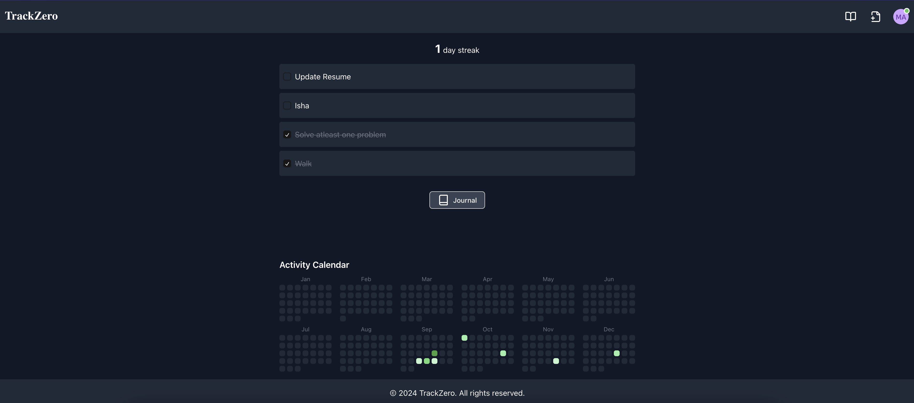
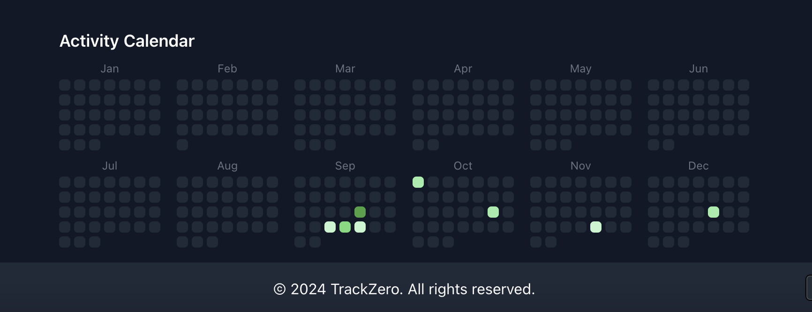

# TrackZero

**TrackZero** is a habit tracking application designed to help you maintain consistency and achieve your goals by ensuring you have no zero days. Inspired by the **No Zero Day Philosophy** by reddit user /u/ryans01, TrackZero provides a simple and intuitive interface to track your daily tasks, journal entries, and monitor your progress over time.

## Table of Contents

- [Features](#features)
- [Demo](#demo)
- [Screenshots](#screenshots)
- [Installation](#installation)
- [Usage](#usage)
- [Technologies Used](#technologies-used)
- [License](#license)
- [Contact](#contact)
- [Acknowledgements](#acknowledgements)

## Features

- **Task Management**: Add, complete, and delete daily tasks to keep track of your habits.
- **Streak Tracking**: Visual representation of your streak to motivate continuous progress.
- **Journal Entries**: Write daily journal entries to reflect on your day and thoughts.
- **Activity Calendar**: View your activity over the year in a calendar format similar to GitHub's contribution graph.
- **No Zero Day Wiki**: Access information about the No Zero Day philosophy within the app.
- **Responsive Design**: Mobile-friendly interface ensuring accessibility on all devices.
- **User Authentication**: Secure signup and login using email/password or Google authentication.
- **Data Persistence**: Your data is securely stored using Firebase Firestore.

## Demo

[Live Demo](https://trackzero.hackerslash.me/) 

## Screenshots


*Dashboard displaying tasks and streak.*


*Activity calendar showcasing daily progress.*

## Installation

### Prerequisites

- [Node.js](https://nodejs.org/) (Version 14 or above)
- [npm](https://www.npmjs.com/) or [Yarn](https://yarnpkg.com/)
- [Firebase Account](https://firebase.google.com/) (For Authentication and Firestore)

### Steps

1. **Clone the Repository**

   ```bash
   git clone https://github.com/hackerslash/trackzero.git
   cd trackzero
   ```
2. **Install Dependencies**

   ```bash
   npm install
   # or
   yarn install
   ```
3. **Configure Firebase**

   - Create a new project in [Firebase Console](https://console.firebase.google.com/).
   - Enable **Authentication** (Email/Password and Google Sign-In providers).
   - Enable **Cloud Firestore** in test mode.
   - Copy your Firebase configuration and replace the placeholders in `firebaseConfig.ts`:

     ```typescript
     // firebaseConfig.ts
     const firebaseConfig = {
       apiKey: "YOUR_API_KEY",
       authDomain: "YOUR_AUTH_DOMAIN",
       projectId: "YOUR_PROJECT_ID",
       storageBucket: "YOUR_STORAGE_BUCKET",
       messagingSenderId: "YOUR_MESSAGING_SENDER_ID",
       appId: "YOUR_APP_ID",
       measurementId: "YOUR_MEASUREMENT_ID",
     };
     ```
4. **Run the Application**

   ```bash
   npm run dev
   # or
   yarn dev
   ```
5. **Open in Browser**

   Navigate to `http://localhost:3000` to access TrackZero.

## Usage

1. **Sign Up / Sign In**

   - Create an account using your email and password.
   - Or sign in using your Google account.
2. **Add Tasks**

   - Click on the add task icon to open the settings.
   - Add the bare minimum tasks you need to complete in a day to make it a non zero day.
3. **Complete Tasks**

   - Mark tasks as completed by checking the checkbox next to each task.
   - Your progress will be reflected in your daily streak and activity calendar.
4. **Write Journal Entries**

   - Click on the **Journal** button to write daily journal entries.
   - Reflect on your progress, thoughts, or anything you'd like to note.
5. **View Activity Calendar**

   - Scroll down to see your activity calendar.
   - Click on any date to view journal entries for that day.
6. **Access No Zero Day Wiki**

   - Click on the **📖** icon to read about the No Zero Day philosophy.
   - Learn how to stay motivated and maintain consistency.

## Technologies Used

- **React** with **TypeScript**
- **Next.js** for server-side rendering and routing
- **Firebase** for authentication and Firestore database
- **Tailwind CSS** for styling
- **Lucide Icons** for iconography
- **Vercel** for deployment (optional)


## License

This project is licensed under the **MIT License**.

## Contact

For any inquiries or feedback, please contact me at [afridijnv19@gmail.com](mailto:afridijnv19@gmail.com).

GitHub: [hackerslash](https://github.com/hackerslash)

## Acknowledgements

- **[Firebase](https://firebase.google.com/)**: For providing authentication and database services.
- **[React](https://reactjs.org/)**: For the powerful front-end library.
- **[Next.js](https://nextjs.org/)**: For server-side rendering and routing.
- **[Tailwind CSS](https://tailwindcss.com/)**: For the utility-first CSS framework.
- **[Lucide Icons](https://lucide.dev/)**: For the beautiful icon set.
- **[No Zero Day Philosophy](https://www.reddit.com/r/NonZeroDay/comments/1qbxvz/the_gospel_of_uryans01_helpful_advice_for_anyone/)**: Inspiration behind the app.

---

*Made with ❤️ by hackerslash.*

[](https://github.com/hackerslash)

# Thank You

Thank you for using TrackZero! If you have any suggestions or encounter any issues, please feel free to open an issue or submit a pull request.

---
